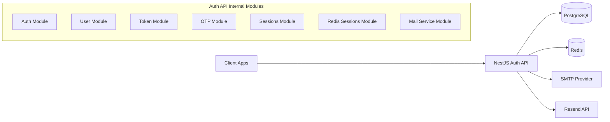

# Nest Auth Service

Production-oriented authentication and account lifecycle service built with NestJS, PostgreSQL, and Redis.

This service supports two authentication pipelines:

- Database-backed token and session persistence.
- Redis-backed OTP/session/token-family flow for faster revocation and low-latency verification.

## 1. System Overview

### 1.1 Responsibilities

- User registration and account verification (email OTP + tokenized link).
- Login and JWT issuance (access + refresh tokens).
- Refresh token rotation.
- Device/session logout and global logout.
- Forgot/reset password workflows.
- API versioning, Swagger docs, consistent response envelope, and global exception handling.

### 1.2 Runtime Architecture



### 1.3 Infrastructure Components

- API Runtime: NestJS 10 on Node.js 20.
- Database: PostgreSQL 16 (TypeORM).
- Cache/State: Redis (OTP, refresh token families, Redis sessions, throttling storage).
- API Docs: Swagger UI at /api.
- Local Infra Orchestration: Docker Compose (Postgres, pgAdmin, Redis, RedisInsight).

## 2. Codebase Topology

### 2.1 Core Modules

- auth: Controllers, guards, JWT strategies, auth business logic.
- user: User entity and user lifecycle services.
- user-tokens: Persistent verification/reset tokens (DB-backed flow).
- sessions: Persistent DB sessions keyed by JWT jti.
- redis-sessions: Session state in Redis for Redis-backed flow.
- otp: OTP generation/validation with attempt counters in Redis.
- token: Refresh/access token issuance and family revocation in Redis.
- integration-services/mail-service: SMTP and Resend email delivery.
- redis: Global Redis client and helper service.
- shared: Config, decorators, exception hierarchy, response wrappers, interceptors.

### 2.2 Request Lifecycle

1. Request hits versioned route prefix /v1.
2. Global throttler checks limits (stored in Redis).
3. Route-level guards validate access or refresh token.
4. Business service executes with Postgres and/or Redis.
5. Global response interceptor wraps non-standard responses.
6. Global exception filter maps errors to consistent JSON format.

## 3. Authentication Flows

### 3.1 Standard DB-Backed Flow

- register: Creates user, stores verification token and OTP in Postgres, sends email.
- login: Validates credentials, issues JWT pair, stores session in Postgres by jti.
- verify: Validates token/OTP from verification_tokens and activates account.
- forgot/reset password: Uses Postgres-stored token/OTP and revokes existing sessions.
- refresh-token: Verifies refresh token, rotates jti session, re-issues pair.
- logout/logout-all: Revokes one or all DB sessions.

### 3.2 Redis-Backed Flow

- register-with-redis: Creates user, generates OTP + verify token in Redis.
- login-with-redis: Creates Redis session, issues family-scoped refresh token.
- verify-with-redis: Validates OTP from Redis and activates account.
- forgot/reset-password-with-redis: Uses Redis OTP and updates password.
- refresh-token-with-redis: Verifies family record, rotates pair, revokes family/session.
- logout-with-redis/logout-all-with-redis: Revokes session(s) and token family/families.

## 4. API Surface

### 4.1 Base URLs

- API (local): http://localhost:3010
- Versioned routes: /v1/\*
- Swagger: /api

### 4.2 Auth Endpoints

Redis-backed:

- POST /v1/auth/register-with-redis
- POST /v1/auth/login-with-redis
- POST /v1/auth/verify-with-redis
- POST /v1/auth/resend-otp-with-redis
- POST /v1/auth/forgot-password-with-redis
- POST /v1/auth/reset-password-with-redis
- POST /v1/auth/refresh-token-with-redis
- POST /v1/auth/logout-with-redis
- POST /v1/auth/logout-all-with-redis

DB-backed:

- POST /v1/auth/register
- POST /v1/auth/login
- POST /v1/auth/verify
- POST /v1/auth/resend-verification
- POST /v1/auth/forgot-password
- POST /v1/auth/reset-password
- POST /v1/auth/refresh-token
- POST /v1/auth/logout
- POST /v1/auth/logout-all

## 5. Data and State Design

### 5.1 PostgreSQL Entities

- users
  - Identity and account status.
  - Password stored as hash.
  - Activation/password change/login timestamps.

- verification_tokens
  - OTP + token records for EMAIL_VERIFICATION and PASSWORD_RESET.
  - Used/expiry metadata.

- sessions
  - Active device sessions keyed by JWT jti.
  - Device and IP metadata.

### 5.2 Redis Keyspace

- otp:register:{email}
- otp:reset:{email}
- verify:email:token:{token}
- session:{sessionId}
- sessions:{userId}
- refresh-token:{userId}:{family}
- token-families:{userId}
- rate:otp:{identifier}

Default TTLs:

- OTP: 10 minutes.
- Email verification token: 10 minutes.
- Session: 7 days.
- Refresh token record: 7 days.
- OTP rate-limit key: 1 hour.

## 6. Security and Platform Controls

### 6.1 JWT and Session Controls

- Access and refresh tokens use separate secrets.
- Refresh endpoints validate token signatures and session state.
- Session revoke-on-expiry behavior for stale refresh tokens.
- Logout-all support in both storage modes.

### 6.2 Request Throttling

Global throttler profiles:

- short: 3 requests / 5s
- medium: 10 requests / 30s
- long: 20 requests / 60s

Throttler state is persisted in Redis.

### 6.3 Error and Response Contracts

- GlobalExceptionFilter normalizes errors into a typed API shape.
- TransformResponseInterceptor and ResponseBuilder enforce consistent success payloads.

## 7. Configuration

No .env.example currently exists in the repository. Create .env in project root using the variables below.

### 7.1 Required Environment Variables

Application:

- PORT=3010
- APP_NAME=auth
- APP_URL=http://localhost:3010
- APP_LINK=http://localhost:3010

JWT:

- JWT_SECRET_KEY=replace_with_secure_access_secret
- JWT_REFRESH_SECRET_KEY=replace_with_secure_refresh_secret
- JWT_ACCESS_EXPIRES=15m
- JWT_REFRESH_EXPIRES=7d

PostgreSQL:

- DB_HOST=localhost
- DB_PORT=5432
- DB_USER=admin
- DB_PASSWORD=secret
- DB_NAME=auth

Redis:

- REDIS_HOST=localhost
- REDIS_PORT=6379
- REDIS_PASSWORD=
- REDIS_DB=0
- REDIS_TTL=300

Mail/Email:

- MAIL_HOST=smtp.example.com
- MAIL_PORT=587
- MAIL_USER=your_smtp_user
- MAIL_PASSWORD=your_smtp_password
- MAIL_FROM=no-reply@example.com
- RESEND_API_KEY=your_resend_api_key

## 8. Local Development

### 8.1 Prerequisites

- Node.js 20+
- npm 10+
- Docker and Docker Compose

### 8.2 Start Infrastructure Dependencies

```bash
docker compose up -d
```

This starts:

- PostgreSQL: localhost:5432
- pgAdmin: http://localhost:8080
- Redis: localhost:6379
- RedisInsight: http://localhost:5540

### 8.3 Install and Run API

```bash
npm install
npm run start:dev
```

Service starts on http://localhost:3010 by default.

### 8.4 Swagger and Health Check

- Swagger UI: http://localhost:3010/api
- Sample app endpoint: GET /v1/

## 9. Build, Test, and Quality

### 9.1 Build

```bash
npm run build
npm run start:prod
```

### 9.2 Test Commands

```bash
npm run test
npm run test:e2e
npm run test:cov
```

### 9.3 Lint/Format

```bash
npm run lint
npm run format
```

## 10. Docker Notes

The current Dockerfile builds the app and runs start:dev from a single stage. For production deployment, prefer:

- Multi-stage build.
- npm ci with lockfile.
- Non-root runtime user.
- Runtime stage that executes node dist/main.

## 11. Production Hardening Checklist

- Disable TypeORM synchronize and move to explicit migrations.
- Restrict CORS origins (avoid wildcard with credentials).
- Rotate JWT secrets and enforce secret management via vault.
- Add structured logging and request correlation IDs.
- Add readiness/liveness endpoints for orchestration.
- Add metrics and tracing (for example Prometheus and OpenTelemetry).
- Ensure SMTP/Resend failover and delivery observability.
- Add Redis/Postgres backup and recovery procedures.
- Add CI pipeline gates for lint, test, and security scans.

## 12. Operational Runbook (Quick)

Common checks:

```bash
docker ps
docker logs pg_container --tail 100
docker logs redis_container --tail 100
npm run test:e2e
```

Reset local infrastructure:

```bash
docker compose down -v
docker compose up -d
```

## 13. Current Trade-Offs to Track

- synchronize: true in TypeORM is useful for local speed but unsafe for production schema control.
- CORS is currently permissive for broad integration testing.
- Both DB and Redis auth flows coexist, increasing flexibility but also complexity and maintenance surface.

---

If you want, the next iteration can include:

- A ready-to-use .env.example.
- Sequence diagrams for each auth flow.
- A deployment section for Kubernetes or ECS/Fargate.
